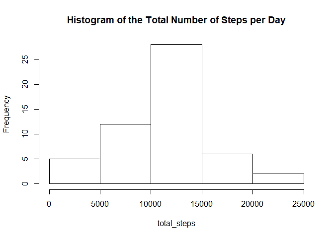
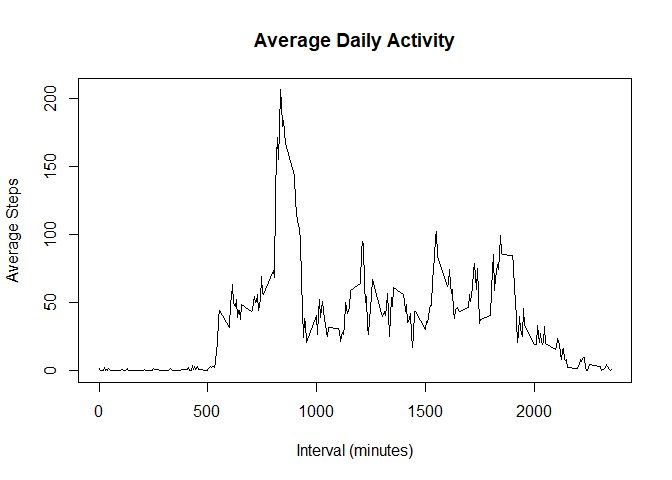
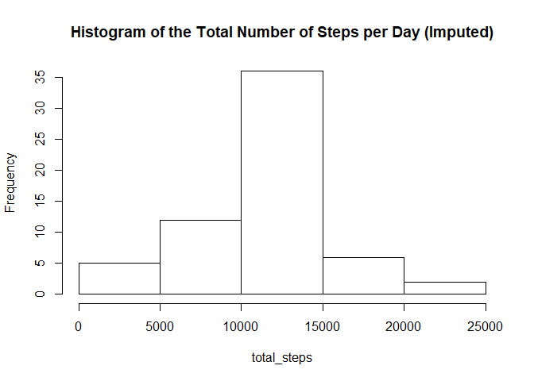
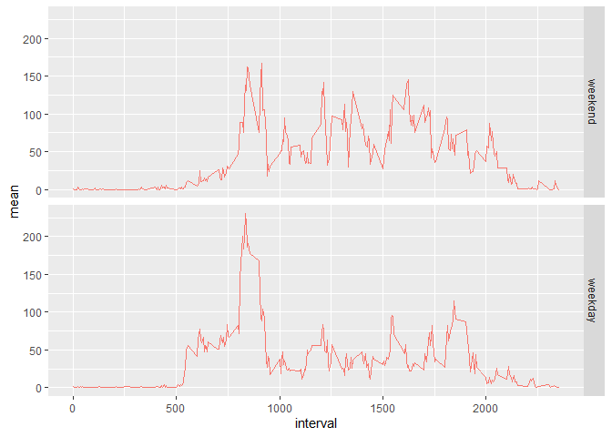

## Loading and preprocessing the data
Read the data using the ```read.csv()``` function.

```r
data <- read.csv("activity.csv")
```

Format the date using ```as.Date()``` (date is currently a factor).

```r
data$date <- as.Date(data$date)
head(data$date,5)
```

```
## [1] "2012-10-01" "2012-10-01" "2012-10-01" "2012-10-01" "2012-10-01"
```

Remove rows with missing values.

```r
clean <- data[!is.na(data$steps),]
```

Load dplyr.

```r
library(dplyr)
```

## What is mean total number of steps taken per day?

Create a histogram for the total number of steps taken per day. Note that there are missing values in the steps column.

```r
# Compute the total number of steps per day
total_steps <- tapply(clean$steps, clean$date, sum)
# Plot histogram
hist(total_steps, main="Histogram of the Total Number of Steps per Day")
```

<!-- -->

Calculate the mean number of steps taken per day, followed by the median.

```r
# Compute the mean and median
mean_median <- c(mean(total_steps), median(total_steps))
# Rename column headers
names(mean_median) <- c("Mean", "Median")
# Print
mean_median
```

```
##     Mean   Median 
## 10766.19 10765.00
```

## What is the average daily activity pattern?
Compute the mean number of steps per interval, and plot a time-series graph of the average daily activity.

```r
# Compute the mean steps per interval
mean_steps <- clean %>% group_by(interval) %>% summarise(mean=mean(steps))
# Plot the time-series graph
with(mean_steps ,plot(interval, mean, type="l", main="Average Daily Activity", xlab="Interval (minutes)", ylab="Average Steps"))
```

<!-- -->

Find the interval with the maximum value of average steps.

```r
max_index <- which.max(unlist(mean_steps['mean']))
mean_steps[[max_index,1]]
```

```
## [1] 835
```

## Imputing missing values
Calculate the total number of missing values.

```r
sum(is.na(data))
```

```
## [1] 2304
```
To fill in or impute the missing data, we substitute the missing values from the mean steps per interval (using mean steps per day yields *NaN*).

```r
# Calculate mean steps per interval
mean_interval <- data %>% group_by(interval) %>% summarise(mean=mean(steps, na.rm = TRUE))
# Substitute missing values with mean steps of the corresponding interval
NAs <- data.frame(data[is.na(data[,1]),])
for(i in 1:nrow(mean_interval)){
    NAs[unlist(mean_interval[i,1]) == NAs[,3], 1] <- mean_interval[i,2]
}
```

Create a new dataset that is equal to the original dataset but with the missing date filled in.

```r
filled <- rbind(clean, NAs)
```

Make a histogram of the total number of steps taken each day and Calculate and report the mean and median total number of steps taken per day.

```r
# Compute the total number of steps per day
total_steps <- tapply(filled$steps, filled$date, sum)
# Plot histogram
hist(total_steps, main="Histogram of the Total Number of Steps per Day (Imputed)")
```

<!-- -->

Imputing the data yielded an increase in the middle values of the histogram (10k to 15k steps). The left and right-most parts remain the same.

## Are there differences in activity patterns between weekdays and weekends?
Create a new factor variable in the dataset with two levels -- "weekday" and "weekend" indicating whether a given date is a weekday or weekend day.

```r
# Create negated %in% operator
`%!in%` <- Negate(`%in%`)
# Create factors
weekend <- c("Saturday", "Sunday")
# Add a column for the type of day
filled$daytype <- factor((weekdays(filled$date) %!in% weekend), 
         levels=c(FALSE, TRUE), labels=c('weekend', 'weekday'))
head(filled)
```

```
##     steps       date interval daytype
## 289     0 2012-10-02        0 weekday
## 290     0 2012-10-02        5 weekday
## 291     0 2012-10-02       10 weekday
## 292     0 2012-10-02       15 weekday
## 293     0 2012-10-02       20 weekday
## 294     0 2012-10-02       25 weekday
```

Make a panel plot of the average number of steps taken across weekdays vs weekends.

```r
library(ggplot2)
# Compute the mean steps per interval
mean_steps <- filled %>% group_by(interval, daytype) %>% summarise(mean=mean(steps), daytype=daytype)
```

```
## `summarise()` has grouped output by 'interval', 'daytype'. You can override using the `.groups` argument.
```

```r
# Plot the time-series graph
g <- ggplot(mean_steps, aes(interval, mean, col="blue"))
g + geom_line(show.legend = F) + facet_grid(daytype~.)
```

<!-- -->
